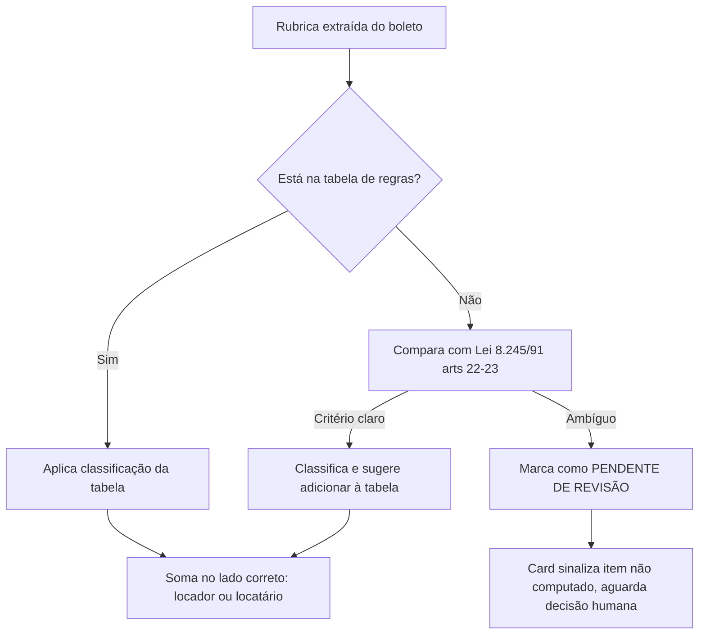

# Blueprint — ADR-COB-001: Sistema de cobrança mensal de locação assistido por IA

> Referência: [ADR-COB-001](./ADR-COB-001.md)

---

## 1. Visão Geral

### Objetivo
Entregar, todo mês, os cards de cobrança de locador e locatário para todos os contratos ativos, calculados corretamente a partir do(s) boleto(s) de condomínio colado(s), com cálculo rastreável e memória auditável — sem app, sem painel.

### Métricas de Sucesso

| Métrica | Antes | Depois | Status |
|---------|-------|--------|--------|
| Tempo de fechamento mensal completo | Manual, refeito do zero todo mês | < 15 min de revisão humana por ciclo | ⬜ |
| Rastreabilidade do cálculo | Nenhuma | 100% dos meses com registro na memória (Notion) | ⬜ |
| Cards enviados com classificação de rubrica não revisada | Não medido, risco implícito | Zero — pendência sempre sinalizada antes do envio | ⬜ |

---

## 2. Estrutura de Artefatos

```
Google Drive/
  Fichas-Locacao (Google Sheets)
    aba: Contratos        → locador, imóvel, locatário, aluguel, IPTU, internet,
                             luz, forma de cobrança de cada item, exceções de contrato
    aba: Regras-Rubrica   → rubrica → classe (ordinária/extraordinária/chamada extra)
                             → responsável padrão → base legal

Claude Project: "Cobrança de Locação"
  Project Knowledge/
    lei-inquilinato-8245-91.md     (arts. 22-23, trechos relevantes)
    codigo-civil-locacao.md        (dispositivos aplicáveis)
    template-card-locador.md
    template-card-locatario.md
    instrucoes-motor.md            (regras de classificação, formato de saída,
                                     critério de quando marcar pendência)

Notion/
  Database: "Memória de Cobrança"
    propriedades: mês, contrato, imóvel, rubricas classificadas,
                   valor locador, valor locatário, status (revisado/enviado),
                   pendências (se houver)
```

---

## 3. Decision Tree



---

## 4. Conceitos Fundamentais

### 4.1 Separação entre cálculo e redação

Todo valor numérico que aparece em um card sai de uma etapa de cálculo determinístico — soma, rateio, proporção. A IA nunca "estima" ou "arredonda de cabeça" um valor de dinheiro de terceiro. Ela decide classificação quando a regra não é auto-evidente, e mesmo assim de forma sinalizada e revisável, e redige o texto do card em cima do número já calculado.

**Configuração:**
```python
def calcular_mes(contrato, rubricas_boleto, regras):
    locador_total = 0
    locatario_total = 0
    pendentes = []
    for r in rubricas_boleto:
        classe = regras.get(r.nome)
        if classe is None:
            pendentes.append(r)
            continue
        if classe == "locador":
            locador_total += r.valor
        else:
            locatario_total += r.valor
    return locador_total, locatario_total, pendentes
```

### 4.2 Tabela de regras de rubrica

Fonte única de verdade para classificação. Mapeia nome da rubrica do boleto de condomínio para o responsável padrão, com base nos arts. 22 (locador — despesas extraordinárias, estruturais) e 23 (locatário — despesas ordinárias, de rotina) da Lei 8.245/91, mais exceções específicas por imóvel/condomínio registradas na ficha do contrato.

**Configuração:**
```
rubrica: "fundo de obras"        | classe: extraordinária | responsável: locador    | base: Lei 8.245/91 art.22, IX
rubrica: "taxa de administração" | classe: ordinária       | responsável: locatário  | base: Lei 8.245/91 art.23, XII
rubrica: "pintura de fachada"    | classe: extraordinária | responsável: locador    | base: Lei 8.245/91 art.22, IV
```

---

## 5. Workflow

### Workflow 1: Fechamento mensal de cobrança

**Objetivo:** gerar todos os cards do mês a partir do(s) boleto(s) colado(s), com memória atualizada.

**Triggers:**
- Luciano cola boleto(s) de condomínio no chat do Project — um a um, em lote, ou como CSV/XLSX

**Steps:**
1. Motor lê as fichas atualizadas na planilha (Drive)
2. Motor identifica quais rubricas do boleto se aplicam a qual contrato/imóvel
3. Motor classifica cada rubrica pela tabela de regras; marca pendências quando não há regra clara
4. Motor calcula, em código, o valor de locador e de locatário por contrato
5. Motor preenche os templates de card (Project Knowledge)
6. Motor grava o registro do mês na memória (Notion)
7. Motor entrega os cards prontos no chat, junto com a lista de pendências, se houver

**Checkpoint:** todos os contratos do mês têm card gerado ou pendência explicitamente sinalizada; memória do mês atualizada no Notion.

---

## 6. Templates

### 6.1 Card de cobrança — locatário

```
Imóvel: {endereço}
Referência: {mês/ano}
Aluguel: R$ {valor_aluguel}
Condomínio (rubricas ordinárias, responsabilidade do locatário): R$ {valor_condominio_locatario}
IPTU: R$ {valor_iptu, se aplicável ao contrato}
Total do mês: R$ {total}
Vencimento: {data}
Observações: {pendências, se houver}
```

### 6.2 Card de cobrança — locador

```
Imóvel: {endereço}
Referência: {mês/ano}
Repasse de aluguel: R$ {valor_repasse}
Despesas extraordinárias do condomínio (responsabilidade do locador): R$ {valor_condominio_locador}
Total líquido: R$ {total}
Observações: {pendências, se houver}
```

---

## 7. Anti-patterns

### 🔴 Crítico

#### Cálculo feito por texto livre da IA, sem passar por código
**O que é:** o valor final do card sai de uma frase gerada pela IA em vez de uma função determinística.
**Por que é ruim:** gera valores não reprodutíveis, sem trilha de auditoria — risco real de erro em dinheiro de terceiros.
**Como evitar:** todo valor numérico do card é resultado de uma função testável, nunca de uma estimativa em prosa.
**Exemplo:**
```
# ❌ ERRADO
"Somando os valores do boleto, o locatário deve pagar aproximadamente R$ 340"

# ✅ CORRETO
locatario_total = sum(r.valor for r in rubricas if regras[r.nome] == "locatario")
# card usa {{locatario_total}} calculado, não estimado
```

### 🟡 Médio

#### Rubrica nova classificada sem checar a tabela de regras
**O que é:** uma rubrica desconhecida é decidida "no ato" pela IA, sem passar pela tabela.
**Por que é ruim:** quebra a consistência mês a mês — o mesmo tipo de item pode ser classificado diferente em meses diferentes.
**Como evitar:** toda rubrica desconhecida vira pendência explícita e só entra na tabela depois de confirmada por Luciano.

### 🟢 Baixo

#### Card enviado sem revisão quando há pendência de classificação
**O que é:** o motor entrega um card como "pronto pra enviar" mesmo com item pendente naquele contrato.
**Por que é ruim:** o valor pode estar incompleto sem que isso fique óbvio no envio.
**Como evitar:** motor nunca marca um card como pronto se houver pendência aberta no contrato correspondente — sinaliza separadamente.

---

## 8. Checklists

### Checklist de Pré-Deploy

- [ ] Planilha de fichas criada e populada com pelo menos um contrato real
- [ ] Tabela de regras de rubrica populada com os itens mais comuns dos boletos recebidos
- [ ] Templates de card (locador e locatário) aprovados por Luciano
- [ ] Legislação relevante carregada no Project Knowledge
- [ ] Conector Google Drive testado com leitura real da planilha
- [ ] Conector Notion testado com escrita real de um registro de teste

### Checklist de Pós-Deploy

- [ ] Primeiro mês fechado com 100% dos contratos revisados manualmente antes do envio
- [ ] Memória do Notion conferida linha a linha no primeiro mês
- [ ] Pendências de classificação do primeiro mês resolvidas e realimentadas na tabela de regras

---

## 9. Edge Cases

### Boleto com rubrica nunca vista antes
**Situação:** item no boleto de condomínio que não está na tabela de regras nem tem base legal óbvia.
**Solução:** marca como pendente; o motor não decide sozinho, pede confirmação.
**Exceção:** se o contrato tiver cláusula explícita cobrindo aquele tipo de despesa, a cláusula do contrato tem prioridade sobre a regra geral.

### Contrato com forma de cobrança atípica
**Situação:** a ficha do contrato indica um modelo fora do padrão (ex: aluguel já embutindo condomínio).
**Solução:** campo de "exceção de cálculo" na ficha do contrato, lido antes de aplicar a regra geral de rubrica.
**Exceção:** nenhuma — exceção registrada na ficha do contrato sempre vence a regra geral.

---

## 10. Integração com Skills Existentes

### Referências Diretas

| Skill | Relação com o workflow |
|-------|------------------------|
| `architecture-review` | Pode revisar esta arquitetura em ciclos futuros, mesmo padrão usado no audit do Secure Notes e do ZEN Starter Kit |
| `writing-plans` | Base da decomposição de tarefas usada no TODO-COB-001 |

---

## 11. Estimativas

| Componente | Linhas Est. | Templates | Examples |
|------------|-------------|-----------|----------|
| Planilha de fichas (schema) | — | 2 abas | 1 contrato real |
| Tabela de regras de rubrica | — | 1 tabela | 15-20 rubricas comuns |
| Project Knowledge (legislação + templates) | — | 5 arquivos | — |
| Motor (instruções de classificação/cálculo) | — | 1 arquivo de instruções | 1 boleto de teste |
| **Total** | **—** | **9** | **2** |

---

## 12. Riscos e Mitigações

| Risco | Impacto | Probabilidade | Mitigação |
|-------|---------|---------------|-----------|
| Conector Drive não lê Google Sheets nativamente | Médio | Média | Validar na Fase A, antes de qualquer outra etapa; fallback: publicar planilha como CSV por URL |
| Rubrica classificada errado | Alto | Baixa, se pendência for sempre sinalizada | Nunca decidir silenciosamente — pendência explícita sempre |
| Planilha de fichas desatualizada | Alto | Média | Checklist de revisão da ficha antes de cada fechamento mensal |
| Notion indisponível ou erro de escrita | Baixo | Baixa | Fallback: gravar também em aba de histórico na própria planilha |

---

*Documento gerado em 2026-07-07. Referência: ADR-COB-001.*
