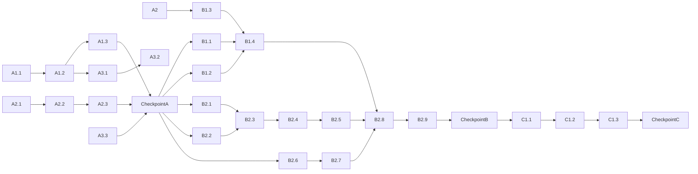

# Change Plan - ADR-COB-001

> Plano interno de execução construído a partir da análise de dependências do TODO.

---

## Identificação

| Campo | Valor |
|-------|-------|
| ADR | docs/adr/ADR-COB-001.md |
| Data de geração | 2026-07-07 |
| Total de tarefas | 25 |
| Estimativa total | ~23h |

---

## DAG de Execução

### Legenda

| Cor | Significado |
|-----|-------------|
| ⬜ | Pendente |
| 🔄 | Em andamento |
| ✅ | Concluído |
| ❌ | Bloqueado |

---

## Ordem de Execução

| Fase | Tarefas | Dependências | Tempo Est. |
|------|---------|--------------|------------|
| A1 | A1.1, A1.2, A1.3 | — | ~3.5h |
| A2 | A2.1, A2.2, A2.3 | — | ~3h |
| A3 | A3.1, A3.2, A3.3 | A1.2 | ~2h |
| Checkpoint A | Validação geral | A1, A2, A3 | — |
| B1 | B1.1, B1.2, B1.3, B1.4 | A2 | ~4.5h |
| B2 | B2.1-B2.9 | A, B1 | ~7.5h |
| Checkpoint B | Validação geral | B1, B2 | — |
| C1 | C1.1, C1.2, C1.3 | B | ~4h |
| Checkpoint C | Validação final | C1 | — |

---

## Tarefas Detalhadas

| # | Tarefa | Estado | Dependências | Prioridade | Estimativa | Arquivos |
|---|--------|--------|--------------|------------|------------|----------|
| A1.1 | Definir schema da aba Contratos | ⬜ | — | 🔴 | 1h | — |
| A1.2 | Criar planilha no Drive | ⬜ | A1.1 | 🔴 | 30min | — |
| A1.3 | Popular com contratos reais | ⬜ | A1.2 | 🔴 | 2h | — |
| A2.1 | Levantar rubricas comuns | ⬜ | — | 🔴 | 1h | — |
| A2.2 | Criar aba Regras-Rubrica | ⬜ | A2.1 | 🔴 | 1h | — |
| A2.3 | Validar tabela contra Lei 8.245/91 | ⬜ | A2.2 | 🔴 | 1h | — |
| A3.1 | Testar leitura via Drive | ⬜ | A1.2 | 🔴 | 30min | — |
| A3.2 | Confirmar leitura Sheets/CSV | ⬜ | A3.1 | 🔴 | 1h | — |
| A3.3 | Testar escrita no Notion | ⬜ | — | 🔴 | 30min | — |
| B1.1 | Extrair Lei 8.245/91 | ⬜ | — | 🔴 | 1h | docs/architecture/ |
| B1.2 | Extrair Código Civil | ⬜ | — | 🟡 | 1h | docs/architecture/ |
| B1.3 | Redigir instruções do motor | ⬜ | A2 | 🔴 | 2h | templates/ |
| B1.4 | Subir Project Knowledge | ⬜ | B1.1, B1.2, B1.3 | 🔴 | 30min | — |
| B2.1 | Definir template locatário | ⬜ | — | 🔴 | 1h | templates/ |
| B2.2 | Definir template locador | ⬜ | — | 🔴 | 1h | templates/ |
| B2.3 | Validar templates com exemplo | ⬜ | B2.1, B2.2 | 🔴 | 1h | — |
| B2.4 | Ajustar redação conforme feedback | ⬜ | B2.3 | 🟡 | 1h | — |
| B2.5 | Subir templates ao Project | ⬜ | B2.4 | 🔴 | 30min | — |
| B2.6 | Definir schema memória Notion | ⬜ | — | 🔴 | 1h | — |
| B2.7 | Criar database no Notion | ⬜ | B2.6 | 🔴 | 30min | — |
| B2.8 | Testar escrita ponta a ponta | ⬜ | B1.4, B2.5, B2.7 | 🔴 | 2h | — |
| B2.9 | Revisar registro gravado | ⬜ | B2.8 | 🔴 | 30min | — |
| C1.1 | Rodar fechamento mês real | ⬜ | B | 🔴 | 2h | — |
| C1.2 | Revisar 100% dos cards | ⬜ | C1.1 | 🔴 | 1h | — |
| C1.3 | Documentar pendências e ajustes | ⬜ | C1.2 | 🟡 | 1h | — |

---

## Tarefas Paralelizáveis

| Fase | Tarefas que podem rodar em paralelo |
|------|--------------------------------------|
| A1 + A2 | A1.1 e A2.1 (independentes) |
| A3 | A3.3 pode rodar com A3.1 (depende de A1.2) |
| B1 + B2 (início) | B1.1, B1.2, B2.1, B2.2, B2.6 (independentes) |

---

## Pontos de Verificação

| Após Tarefa | Verificar | Critério |
|-------------|-----------|----------|
| A1.3 | Planilha criada e populada | Schema aprovado, contratos reais |
| A2.3 | Tabela de regras válida | Pelo menos 15 rubricas com base legal |
| A3.2 | Conectores validados | Leitura e escrita confirmadas |
| B1.4 | Knowledge carregado | Legislação + instruções disponíveis |
| B2.9 | Motor testado | Card gerado + registro Notion |
| C1.3 | Piloto completo | 100% cards revisados, pendências documentadas |

---

## Estimativa Detalhada

| Componente | Tempo Est. | Notas |
|------------|------------|-------|
| Tarefas de infraestrutura (A) | ~8h | Planilha, regras, conectores |
| Tarefas de implementação (B) | ~11h | Knowledge, templates, motor |
| Tarefas de validação (C) | ~4h | Piloto e ajustes |
| Buffer (20%) | ~4.6h | Imprevistos |
| **Total** | **~27.6h** | |

---

## Riscos do Plano

| # | Risco | Impacto no Plano | Mitigação |
|---|-------|------------------|-----------|
| 1 | Conector Drive não lê Sheets | Atraso na Fase A | Fallback CSV publicado |
| 2 | Notion indisponível | Atraso na Fase B | Fallback planilha histórica |
| 3 | Rubricas atípicas no boleto | Mais pendências | Tabela de regras expansível |
| 4 | Feedback de Luciano demorado | Atraso em B2.4 | Agendar revisão antecipada |

---

## Validação do Plano

- [x] DAG construído sem ciclos
- [x] Todas as tarefas têm dependências definidas
- [x] Estimativas somam ao total esperado
- [x] Tarefas paralelizáveis são realmente independentes
- [x] Pontos de verificação cobrem tarefas críticas
- [x] Riscos do plano documentados